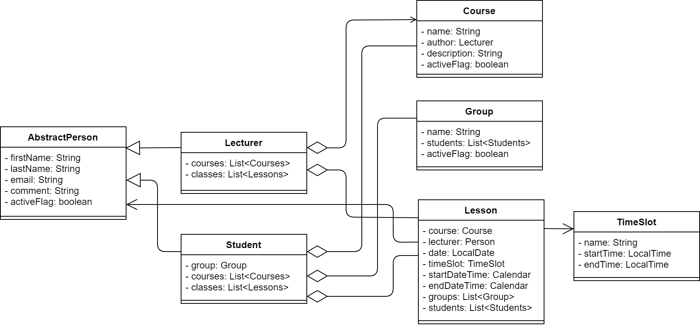
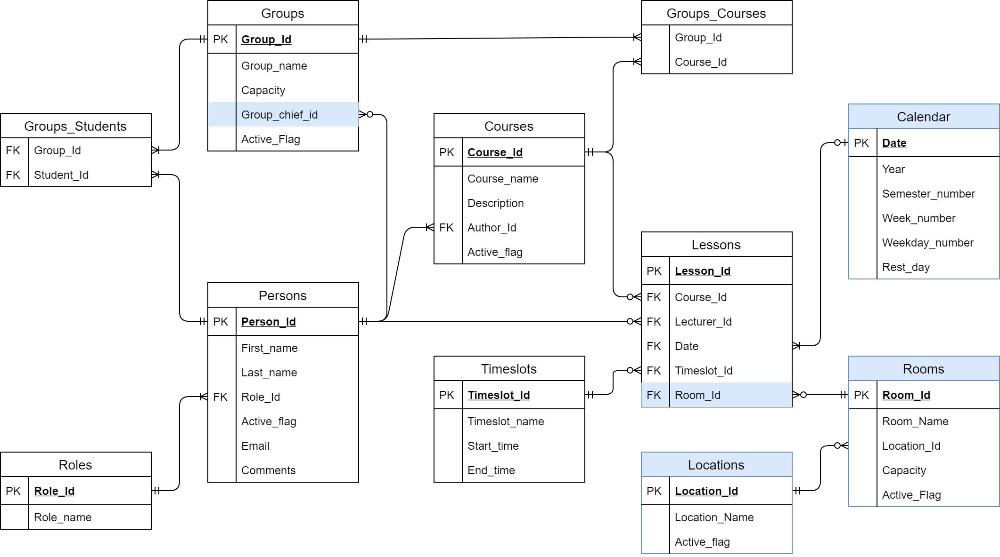

 ## Java CRUD Web application "University"

 This is a training project of the mentoring program of the FoxmindEd training center.

 According to the program, the developing of this application is consisted of several milestones. At each stage, a new application layer or functionality with required library for implementation it is added. In the final, the application is converted to `SpringBoot` and some libraries is replaced with it.

 ### Proposal
 "University" application manages the database of students, teachers, courses and implements a calendar of training sessions via web-interface.

 #### out of scope
 By some reason the training program did not include many functionality and components that are useful for deployment and performance, like
 - authorization && security
 - database tracking & migration
 - caching
 - containerization
 - etc..

 therefore this project does not contain them as well.

 ### Application design
 #### entities
 - Course - certain academic subject
 - Lecturer - the person who is an author of the academic subject or is lecturing
 - Student - the person who is an attendee of lectures
 - Group - the group of Students with is assigned to the Courses
 - Lesson - the event when the Lecturer is reading the Course to the Students
 - Timeslot - assistive entity for specifying the start and end time of Lesson
 

 #### data base scheme
 

 ### Application components
 In the final version, the application includes the following components:  
 - Build tool (`Maven`)
 - IoC (`Spring`, `SpringBoot`)
 - Web-interface (`Thymeleaf`, `Bootstrap`) 
 - REST API
 - API documentation (`Swagger`)
 - Unit tests (`JUnit5`)
 - Integration tests (`MockMVC`)

 Database management system used for data storage: `Postgres` in runtime and `H2` for tests.

 ### Demonstration
 The working instance of this application might be available [here](https://university.demoprojects.online).
